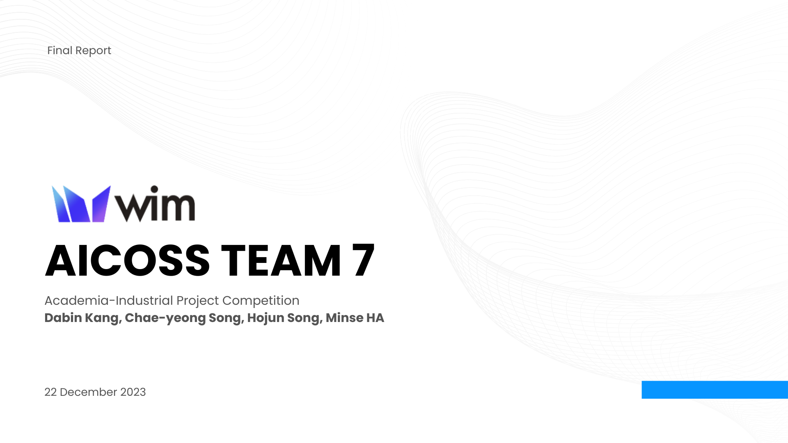
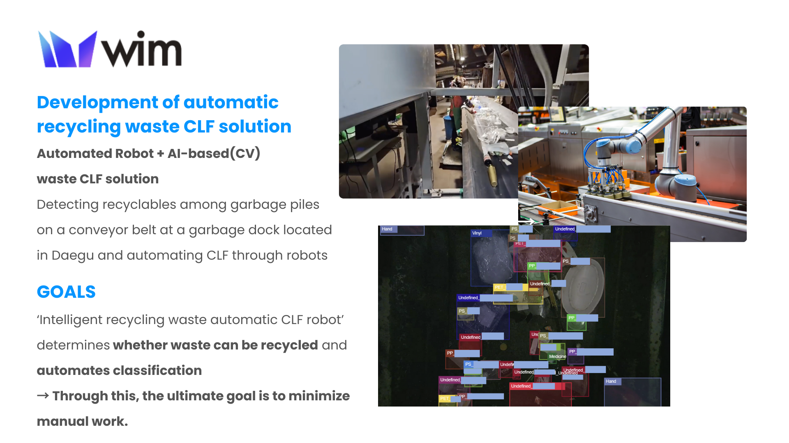
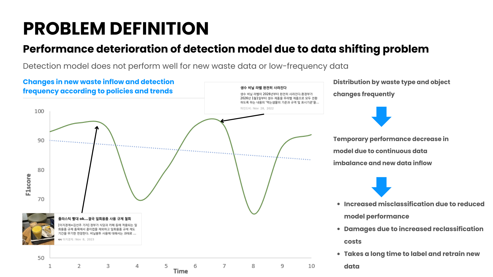
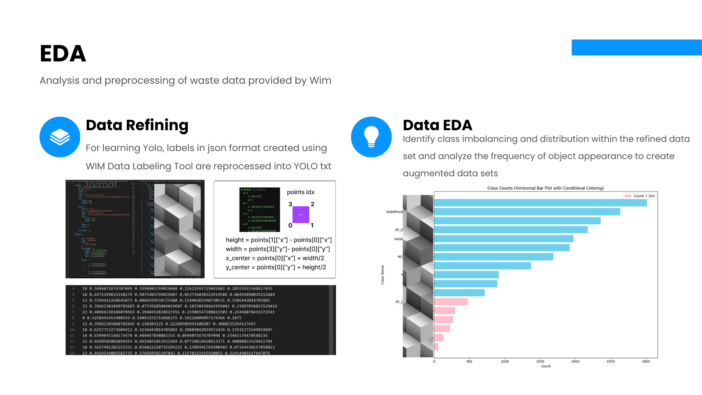
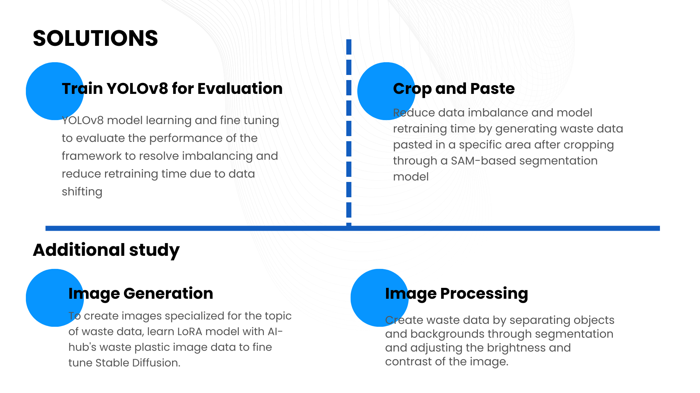
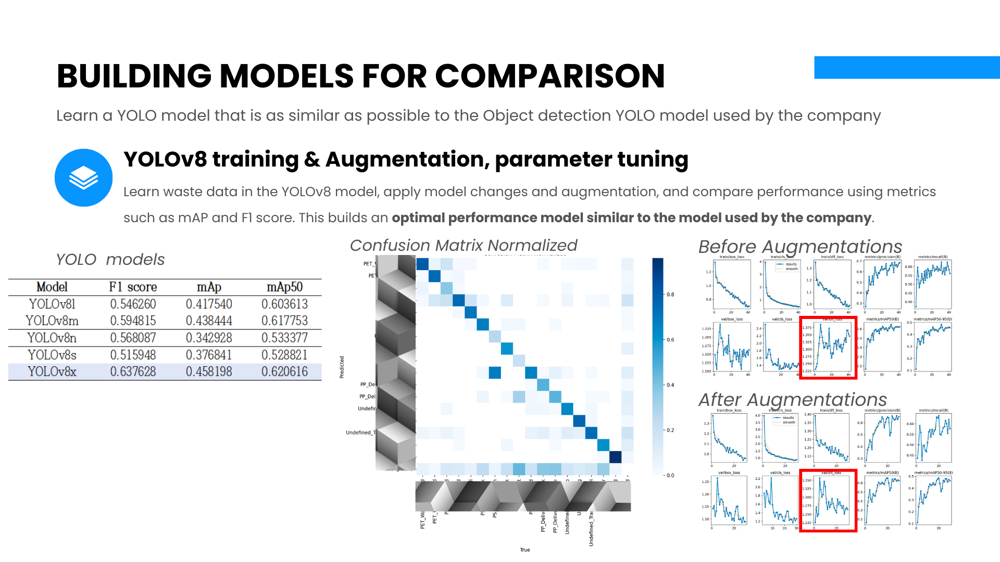
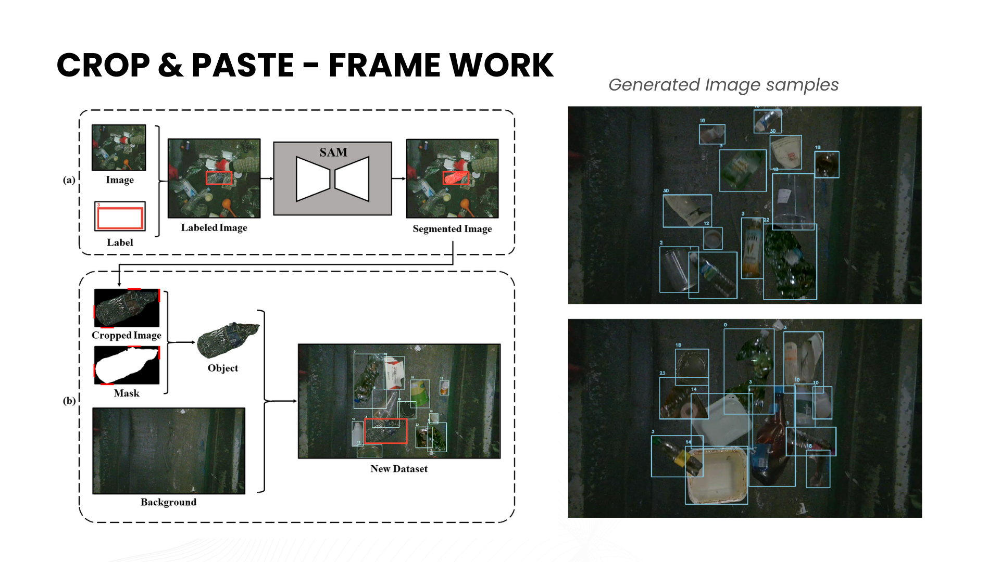
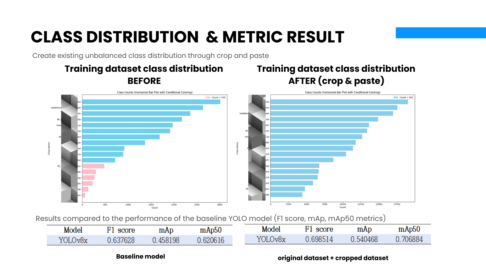
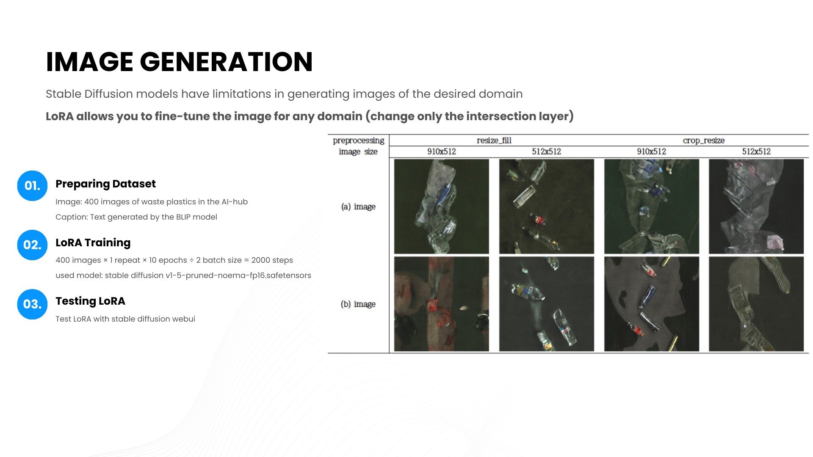
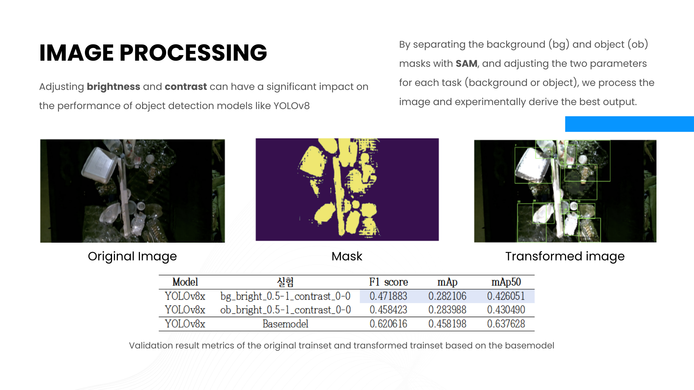

## KNU Industry-Academia Cooperation Project Competition: Solution for recycling waste classification domain (WIM)
- Individual Research Repo  
    - Crop and Pasting [**[Link]**](https://github.com/knu-on-plus/Crop-Pasting)
    - Recycling Waste Detector [**[Link]**](https://github.com/knu-on-plus/Recycling_Waste_Detector)

  
  
  

